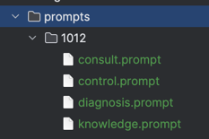
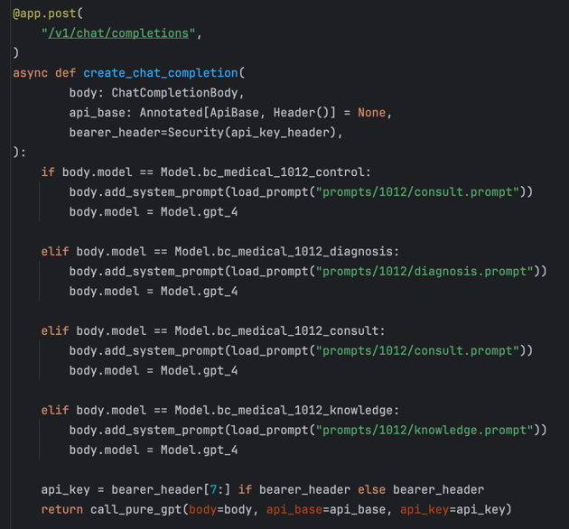

# MedicalGPT - An Medical OpenAI Wrapper

> MedicalGPT is an OpenAI wrapper for restful/sdk usage, which is powered by FastAPI, SSE, Pydantic, authored by
> MarkShawn2020, since Oct 14th, 2023.

## Features

- [x] AAAS（Agent As A Service），支持开箱即用的微服务化多模型设计，用以支撑各个前端
- [x] 遵循 OpenAI 接口规范，支持自定义 api_base、api_key（Bearer抬头）
- [x] 支持 传统/流式 双输出模式
- [x] 支持 OpenAI 官方推荐的指数退降法重试

## Branches

- easy-gpt: 最基础的 gpt wrapper
- medical-gpt: 专为百川AI医疗（以及通用prompt工程）设计

## Usage

### Agent 配置与使用





### start

```shell
source ./start.sh
```

## dev notes

### environment requirements

- urllib3==1.26.6
    - see: python - ImportError: urllib3 v2.0 only supports OpenSSL 1.1.1+, currently the 'ssl' module is compiled with
      LibreSSL 2.8.3 - Stack
      Overflow, https://stackoverflow.com/questions/76187256/importerror-urllib3-v2-0-only-supports-openssl-1-1-1-currently-the-ssl-modu
